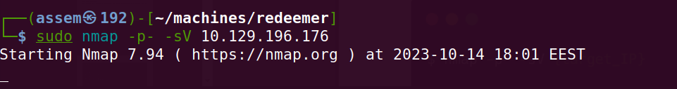
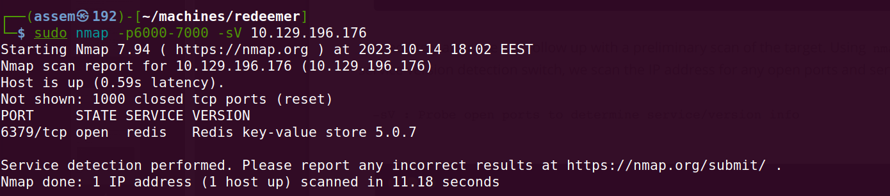
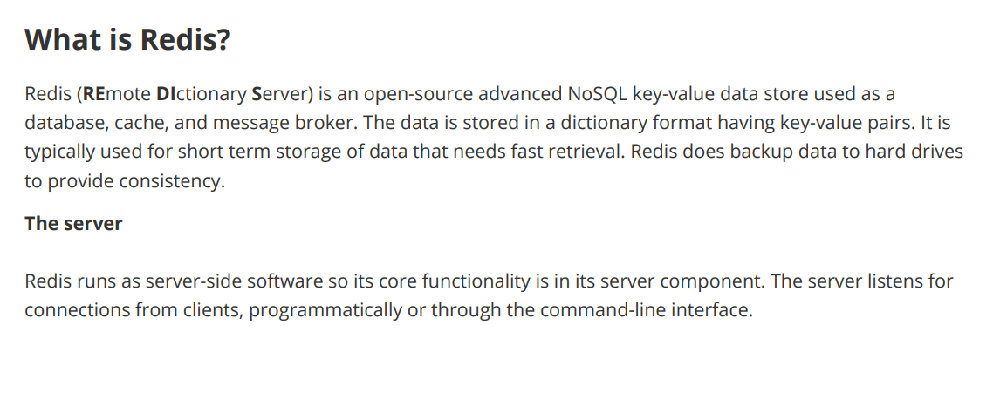
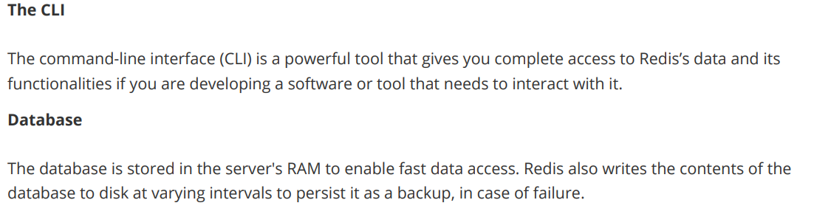
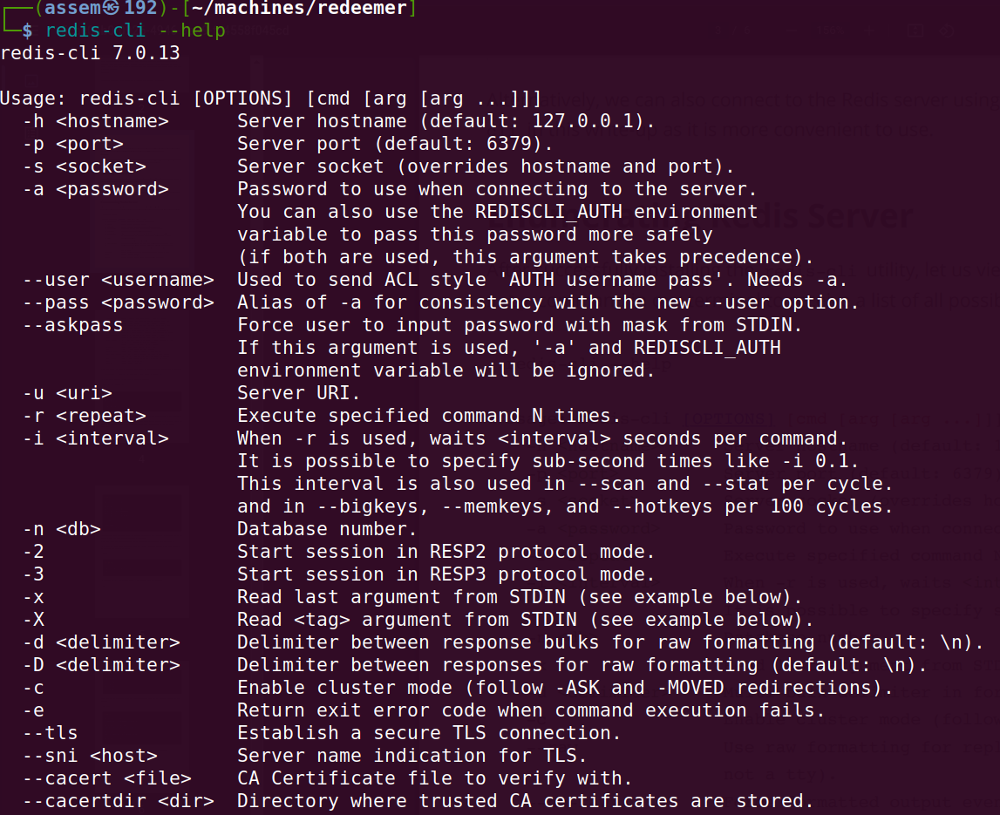
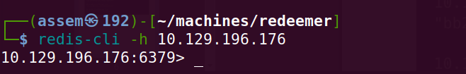
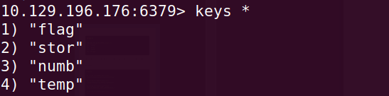
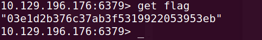

# Basic of penetration testing 

**In our journy to learn penetration testing we take a machines in HTB to can explain the basics of penetration** 

## redeemer machine .

   - after connecting with vpn you will spawn the machine and you will have the ip address for this machine .

   - as we explained in earlier machines you must know how to download vpn and connect with HTB server and ping for IP_address .

### Enumeration .

- we will begin with `nmap` tool to check what is the open ports in the target machine .

- you should use this command ```sudo nmap -p- -sV {IP_address}``` as following .




- this command will scan all `65535` , you can do this if you have time to wait but because i already made an earlier attack and know   	what is the open port i will be more specific in my nmap command as following.

- ```sudo nmap -p6000-7000 -sV {IP_address}```



- As you see in nmap report ***port 6379/tcp >open , redis > service on the open port*** 


### Every machine has a basic idea to deliver to you .


***the idea of this machine is to make you know what is `redis` service***

- you should have enough searching skills to search about any anonymous thing , we will begin with google searching about redis service.





#### Enumeration with redis_cli .

- installing **redis** with this command ```sudo apt install redis-tools``` .

- get help to know how to use redis-cli



##### foothold .

- we will use this command to connect with the server ``` redis-cli -h {host_IP}``` . 



- now we are in the server .

- we should know how to deal with the server with commands .

- we will search about the redis commands in google.

- here " https://redis.io/docs/ui/cli/ " this link will provide you with all information about redis server commands .

***after geting in***

- we will use the ```key *``` command to get a list of all values in the server.



- As you see there is four keys which one of them is "flag" .

- we will use the ```get {key_name}``` to get the velue inside the key .



- now you have the flag , just put it in the HTB website .

- you must not leave this machine untill you know what is redis and know how to deal with it .

***we are finished with this machine***
